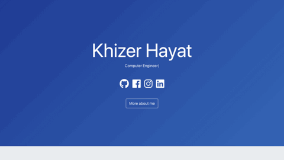
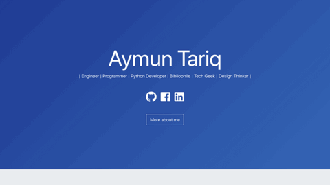
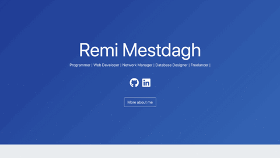

<!-- PROJECT LOGO -->
<br />
<p align="center">
  <h1 align="center">Developer's Portfolio ✨</h1>

  <p align="center">
    It is a personal static website/portfolio template hosted with GitHub Pages, built to showcase my recent projects. Site URL / Demo: 
    <a href="https://hashirshoaeb.github.io">hashirshoaeb.github.io</a>
    <br />
    <br />
    <a href="https://hashirshoaeb.com">About Me</a>
    ·
    <a href="https://github.com/hashirshoaeb/home/issues">Report Bug</a>
    ·
    <a href="https://github.com/hashirshoaeb/home/issues">Request Feature</a>
  </p>
</p>


[](https://github.com/hashirshoaeb/star_book/network)
[](https://github.com/hashirshoaeb/star_book/issues)
[](https://github.com/hashirshoaeb/home/blob/master/LICENSE)
[](https://twitter.com/hashirshoaeb)

[](https://hashirshoaeb.github.io/)

## Table of Contents

- [Technology Stack 🛠️](#technology-stack-)
- [Structure ⚓](#structure-)
- [Sharing 💗](#sharing-)
- [Prerequisites 🍪](#prerequisites-)
- [Setup And Deployment 🔧](#setup-and-deployment-)
- [Contributing 🙌](#contributing-)
- [Issues](#issues)
- [Upcoming Features / Improvements 🔗](#upcoming-features-/-improvements-)
- [Showcase 🚀](#showcase-)
- [Contributors ✨](#contributors-)
- [License 📄](#license-)

## Technology Stack 🛠️

Dependencies defined in package.json:

[Reactjs](https://reactjs.org/)
| [Bootstrap](https://getbootstrap.com/)
| [Typist](https://github.com/jstejada/react-typist)
| [GitHub API](https://developer.github.com/v3/repos/)
| [Instagram API](https://www.instagram.com/developer/embedding/)

## Structure ⚓

- Navigation bar (optional)
- Blog (optional)
- Body
  - Name | Profession
  - Contact / Follow / Find me / Facebook / LinkedIn / GitHub / Instagram / Email / CodePen
  - Resume | About me
- About Me
  - Display picture (using Instagram API) (optional)
  - About myself, my Interests, Goals and Hobbies
  - Things I'm good at (Skills)
- Recent Projects (using GitHub API) (optional)
- Footer
  - Acknowledgements (contributors)
  - Copyrights - open source
  - (quote: Dream big, Think big)

## Sharing 💗

Project is open source. Feel free to make your own version. All you need to do is to fork this repository, edit [src/editable-stuff/configurations.json](./src/editable-stuff/configurations.json) and add resume. Mark star ⭐ if you like the project.

## Prerequisites 🍪

You should have [Node.js](https://nodejs.org/en/) and [Git](https://git-scm.com/) installed on your PC. You should also own a GitHub account.

## Setup And Deployment 🔧

1. To Get Started, Fork this repository to your GitHub account:
2. Clone the forked repo from your account using:

   ```bash
     git clone https://github.com/<your-username>/home.git
   ```

3. Open in editor and edit [src/editable-stuff/configurations.json](./src/editable-stuff/configurations.json) file.

4. Add your resume as <resume.pdf> in place of [src/editable-stuff/resume.pdf](./src/editable-stuff/)
5. Change URL in [package.json](./package.json) file:

   ```json
   "homepage": "https://<your-username>.github.io/home"
   ```

   Or for custom deployment, refer [create-react-app.dev](https://create-react-app.dev/docs/deployment/)

6. Edit [title](./public/index.html#L34) and meta [description](./public/index.html#L13) in [public/index.html](./public/index.html).

7. After editing run the following bash commands:

   ```bash
   npm install
   npm start
   ```

8. To deploy website run:

   ```bash
    npm run build
    npm run deploy
   ```

   Or for custom deployment, refer [pages.js](./pages.js)

   ```bash
    npm run build
    npm run custom-deploy
   ```

9. Congrats your site is up and running. To see it live, visit:

   ```https
     https://<your-username>.github.io/home
   ```

Facing issues? Feel free to contact at hashirshoaeb@gmail.com.

## Contributing 🙌

Pull requests are welcome. For major changes, please open an issue first to discuss what you would like to change.

## Issues

If anyone is looking to make some contribution, the following are issues that you can solve:

- [ ] UI improvements
- [ ] Code optimization
- [x] Routing
- [ ] SEO

## Upcoming Features / Improvements 🔗

- [x] Button and place for resume/CV.
- [x] Option: add or not to add Instagram's display picture.
- [x] Number of projects to show in website.
- [x] If the Number of Projects are zero, hide the heading (Recent Projects).
- [ ] Blogs page.
- [ ] Make resume optional.

## Showcase 🚀

Have you changed something in the code to create your own version? Feel free to share with me, I will list them in this space.

<table>
  <tr>
    <td align="center">
      <a href="https://github.com/khizarkhizar/home/">
        
        <br />
        <sub><b>Khizar Hayyat</b></sub>
      </a>
      <br />
    </td>
    <td align="center">
      <a href="https://github.com/hamzasohail0/home/">
        
        <br />
        <sub><b>Hamza Sohail</b></sub>
      </a>
      <br />
    </td>
    <td align="center">
      <a href="https://github.com/AymunTariq/home/">
        
        <br />
        <sub><b>Aymun Tariq</b></sub>
      </a>
      <br />
    </td>
  </tr>
  <tr>
    <td align="center">
      <a href="https://github.com/ishaan-m/home/">
        
        <br />
        <sub><b>Ishaan Manudhane</b></sub>
      </a>
      <br />
    </td>
    <td align="center">
      <a href="https://github.com/meenams/home/">
        
        <br />
        <sub><b>Meena Muthusubramanian</b></sub>
      </a>
      <br />
    </td>
    <td align="center">
      <a href="https://github.com/remimestdagh/home/">
        
        <br />
        <sub><b>Remi Mestdagh</b></sub>
      </a>
      <br />
    </td>
  </tr>
</table>

## Contributors ✨

<table>
  <tr>
    <td align="center">
      <a href="https://www.facebook.com/hashir.shoaeb">
        
        <br />
        <sub><b>Hashir Shoaib</b></sub>
      </a>
      <br />
    </td>
    <td align="center">
      <a href="https://github.com/iprithvitharun">
        
        <br />
        <sub><b>Prithvi Tharun</b></sub>
      </a>
      <br />
    </td>
    <td align="center">
      <a href="https://github.com/CodyJasonBennett">
        
        <br />
        <sub><b>Cody Bennett</b></sub>
      </a>
      <br />
    </td>
    <td align="center">
      <a href="https://github.com/yonis9">
        
        <br />
        <sub><b>Yoni Sisso</b></sub>
      </a>
      <br />
    </td>
    <td align="center">
      <a href="https://github.com/mallikarjuna-sharma">
        
        <br />
        <sub><b>Mallikarjuna Sharma</b></sub>
      </a>
      <br />
    </td>
  </tr>
</table>

## License 📄

[LGPL-3.0](https://www.gnu.org/licenses/lgpl-3.0.en.html)

## Stargazers over time

[](https://starchart.cc/hashirshoaeb/home)
