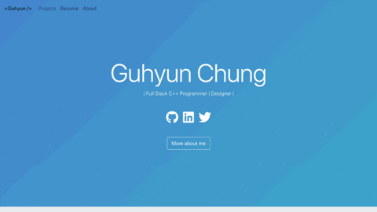

<!-- PROJECT LOGO -->
<br />
<p align="center">
  <h1 align="center">Portifólio de Desenvolvedor ✨</h1>

  <p align="center">
    Um site pessoal estático feito para mostrar projetos recentes. URL do Site / Demo: 
    <a href="https://home.tashima.tech">https://home.tashima.tech</a>
    <br />
    <br />
    <a href="https://home.tashima.tech">Sobre Mim</a>
    ·
    <a href="https://github.com/hashirshoaeb/home/issues">Reportar Bug</a>
    ·
    <a href="https://github.com/hashirshoaeb/home/issues">Pedir Feature</a>
  </p>
</p>


[](https://github.com/hashirshoaeb/star_book/network)
[](https://github.com/hashirshoaeb/star_book/issues)
[](https://github.com/hashirshoaeb/home/blob/master/LICENSE)
[](https://twitter.com/hashirshoaeb)

[](https://hashirshoaeb.github.io/)

## Sumário

- [Tecnologias Utilizadas 🛠️](#tecnologias-utilizadas-)
- [Estrutura ⚓](#estrutura-)
- [Compartilhando💗](#compartilhando-)
- [Pré-requisitos🍪](#pré-requisitos)
- [Setup E Deployment 🔧](#setup-e-deployment-)
- [Contribuindo🙌](#contribuindo-)
- [Problemas](#problemas)
- [Próximas Features / Melhorias 🔗](#próximas-features--melhorias-)
- [Showcase 🚀](#showcase-)
- [Versão em Português :brazil:](#versao-em-portugues-)
- [Contributors ✨](#contributors-)
- [License 📄](#license-)

## Tecnologias Utilizadas 🛠️

Dependencias definidas no package.json:

[Reactjs](https://reactjs.org/)
| [Bootstrap](https://getbootstrap.com/)
| [Typist](https://github.com/jstejada/react-typist)
| [GitHub API](https://developer.github.com/v3/repos/)
| [Instagram API](https://www.instagram.com/developer/embedding/)

## Estrutura ⚓

- Navigation bar (opicional)
- Blog (opicional)
- Body [corpo]
  - Nome | Profissão
  - Contato / Follow / Find me / Facebook / LinkedIn / GitHub / Instagram / Email / CodePen
  - Currículo | Sobre mim
-  Sobre mim
  - Foto de perfil (usando API do Instagram) (opicional)
  - Sobre mim, meus interesses Metas e Hobbies
  - Coisas em que sou bom (Skills)
- Projetos Recentes (usando API do GitHub) (opicional)
- Footer [rodapé]
  - Reconhecimentos (contribuidores)
  - Copyrights - open source
  - (citação: Sonhe grande, Pense grande)

## Compartilhando 💗

O projeto é open-souce. Fique a vontade para fazer sua própria versão. Tudo o que você precisa fazer é criar um fork, editar [src/editable-stuff/configurations.json](./src/editable-stuff/configurations.json) e adicionar seu Currículo. Se você gostou do projeto, dê uma ⭐.

## Pré-requisitos🍪

Você precisa ter o [Node.js](https://nodejs.org/en/) e o  [Git](https://git-scm.com/) instalados no seu PC. Você tambem deve ter uma conta no GItHub.

## Setup E Deployment 🔧

1. Para começar, crie um fork deste repositório na sua conta:
2. Clone o repositório que você acabou de fazer um fork usando:

   ```bash
     git clone https://github.com/<seu-username>/home.git
   ```

3. Abra em um editor e altere o arquivo [src/editable-stuff/configurations.json](./src/editable-stuff/configurations.json).

4. Adicione o seu currículo como <resume.pdf> no lugar de [src/editable-stuff/resume.pdf](./src/editable-stuff/)
5. Altere a URL no arquivo [package.json](./package.json):

   ```json
   "homepage": "https://<seu-username>.github.io/home"
   ```

   Ou, para um deployment customizado,  leia [create-react-app.dev](https://create-react-app.dev/docs/deployment/)

6. Edite [title](./public/index.html#L34) e meta [description](./public/index.html#L13) no [public/index.html](./public/index.html).

7. Após a edição, rode os seguintes comandos bash:

   ```bash
   npm install
   npm start
   ```

8. Para dar deploy 

   ```bash
    npm run build
    npm run deploy
   ```

   Ou para deployment customizado alterar [pages.js](./pages.js)

   ```bash
    npm run build
    npm run custom-deploy
   ```

9. Parabéns, seu site está rodando. Para ver ele live, visite:

   ```https
     https://<your-username>.github.io/home
   ```

Tendo problemas? Entre em contato! hashirshoaeb@gmail.com.

## Contribuindo 🙌

Pull requests são bem vindas. Para grandes mudanças abra um issue antes para discutir o que você gostaria de mudar.

## Problemas

Se você gostaria de contribuir, esses são os problemas que você pode resolver:

- [ ] Melhorias na UI
- [ ] Otimização do código
- [x] Routing
- [ ] SEO

## Próximas Features / Melhorias 🔗

- [x] Botão e lugar para currículo.
- [x] Opção de adicionar ou não a imagem de perfil do instagram.
- [x] Número de projetos que serão mostrados no website.
- [x] Se o número de projetos for zero, esconder a aba Projetos recentes.
- [ ] Página de blogs.
- [ ] Currículo opicional

## Showcase 🚀

Você mudou algo no seu código para fazer sua própria versão? Fique a vontade para compartilhar comigo. Vou ouvir neste espaço

<table>
  <tr>
    <td align="center">
      <a href="https://github.com/justiceserv/justiceserv.github.io">
        
        <br />
        <sub><b>Guhyun Chung</b></sub>
      </a>
      <br />
    </td>
    <td align="center">
      <a href="https://github.com/hamzasohail0/home/">
        
        <br />
        <sub><b>Hamza Sohail</b></sub>
      </a>
      <br />
    </td>
    <td align="center">
      <a href="https://github.com/AymunTariq/home/">
        
        <br />
        <sub><b>Aymun Tariq</b></sub>
      </a>
      <br />
    </td>
  </tr>
  <tr>
    <td align="center">
      <a href="https://github.com/ishaan-m/home/">
        
        <br />
        <sub><b>Ishaan Manudhane</b></sub>
      </a>
      <br />
    </td>
    <td align="center">
      <a href="https://github.com/meenams/home/">
        
        <br />
        <sub><b>Meena Muthusubramanian</b></sub>
      </a>
      <br />
    </td>
    <td align="center">
      <a href="https://github.com/remimestdagh/home/">
        
        <br />
        <sub><b>Remi Mestdagh</b></sub>
      </a>
      <br />
    </td>
  </tr>
</table>

## Versão em Português :brazil:

Esse projeto foi traduzido para português! Se você gostou dele e quer criar a sua própria versão, confira o repositório do [@tashima42](https://github.com/tashima42) em [https://github.com/Tashima42/home](https://github.com/Tashima42/home).
Novas contribuições e revisões na tradução são muito bem vindas! 

## Contributors ✨

<table>
  <tr>
    <td align="center">
      <a href="https://www.facebook.com/hashir.shoaeb">
        
        <br />
        <sub><b>Hashir Shoaib</b></sub>
      </a>
      <br />
    </td>
    <td align="center">
      <a href="https://github.com/iprithvitharun">
        
        <br />
        <sub><b>Prithvi Tharun</b></sub>
      </a>
      <br />
    </td>
    <td align="center">
      <a href="https://github.com/CodyJasonBennett">
        
        <br />
        <sub><b>Cody Bennett</b></sub>
      </a>
      <br />
    </td>
    <td align="center">
      <a href="https://github.com/yonis9">
        
        <br />
        <sub><b>Yoni Sisso</b></sub>
      </a>
      <br />
    </td>
    <td align="center">
      <a href="https://github.com/mallikarjuna-sharma">
        
        <br />
        <sub><b>Mallikarjuna Sharma</b></sub>
      </a>
      <br />
    </td>
  </tr>
</table>

## Licença 📄

[LGPL-3.0](https://www.gnu.org/licenses/lgpl-3.0.en.html)

## Stargazers ao longo do tempo

[](https://starchart.cc/hashirshoaeb/home)
